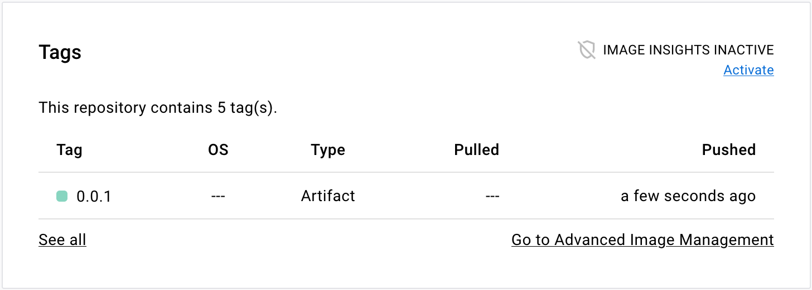

You can use Docker Hub to store any kind of software artifact, not just
container images. A software artifact is any item produced during the software
development process that contributes to the creation, maintenance, or
understanding of the software. Docker Hub supports OCI artifacts by leveraging
the config property on the image manifest.

## What are OCI artifacts?

OCI artifacts are any arbitrary files related to a software application. Some
examples include:

- Helm charts
- Software Bill of Materials (SBOM)
- Digital signatures
- Provenance data
- Attestations
- Vulnerability reports

Docker Hub supporting OCI artifacts means you can use one repository for storing
and distributing container images as well as other assets.

A common use case for OCI artifacts is
[Helm charts](https://helm.sh/docs/topics/charts/). Helm charts is a packaging
format that defines a Kubernetes deployment for an application. Since Kubernetes
is a popular runtime for containers, it makes sense to host application images
and deployment templates all in one place.

## Using OCI artifacts with Docker Hub

You manage OCI artifacts on Docker Hub in a similar way you would container
images.

Pushing and pulling OCI artifacts to and from a registry is done using a
registry client. [ORAS CLI](https://oras.land/docs/installation)
is a command-line tool that provides the capability of managing
OCI artifacts in a registry. If you use Helm charts, the
[Helm CLI](https://helm.sh/docs/intro/install/) provides built-in
functionality for pushing and pulling charts to and from a registry.

Registry clients invoke HTTP requests to the Docker Hub registry API. The
registry API conforms to a standard protocol defined in the
[OCI distribution specification](https://github.com/opencontainers/distribution-spec).

## Examples

This section shows some examples on using OCI artifacts with Docker Hub.

### Push a Helm chart

The following procedure shows how to push a Helm chart as an OCI artifact to
Docker Hub.

Prerequisites:

- Helm version 3.0.0 or later

Steps:

1. Create a new Helm chart

   ```console
   $ helm create demo
   ```

   This command generates a boilerplate template chart.

2. Package the Helm chart into a tarball.

   ```console
   $ helm package demo
   Successfully packaged chart and saved it to: /Users/hubuser/demo-0.1.0.tgz
   ```

3. Sign in to Docker Hub with Helm, using your Docker credentials.

   ```console
   $ helm registry login registry-1.docker.io -u hubuser
   ```

4. Push the chart to a Docker Hub repository.

   ```console
   $ helm push demo-0.1.0.tgz oci://registry-1.docker.io/docker
   ```

   This uploads the Helm chart tarball to a `demo` repository in the `docker`
   namespace.

5. Go to the repository page on Docker Hub. The **Tags** section of the page
   shows the Helm chart tag.

   

6. Select the tag name to go to the page for that tag.

   The page lists a few useful commands for working with Helm charts.

   

### Push a volume

The following procedure shows how to push container volume as an OCI artifact to
Docker Hub.

Prerequisites:

- ORAS CLI version 0.15 or later

Steps:

1. Create a dummy file to use as volume content.

   ```console
   $ touch myvolume.txt
   ```

2. Sign in to Docker Hub using the ORAS CLI.

   ```console
   $ oras login -u hubuser registry-1.docker.io
   ```

3. Push the file to Docker Hub.

   ```console
   $ oras push registry-1.docker.io/docker/demo:0.0.1 \
     --artifact-type=application/vnd.docker.volume.v1+tar.gz \
     myvolume.txt:text/plain
   ```

   This uploads the volume to a `demo` repository in the `docker` namespace. The
   `--artifact-type` flag specifies a special media type that makes Docker Hub
   recognize the artifact as a container volume.

4. Go to the repository page on Docker Hub. The **Tags** section on that page
   shows the volume tag.

   

### Push a generic artifact file

The following procedure shows how to push a generic OCI artifact to Docker Hub.

Prerequisites:

- ORAS CLI version 0.15 or later

Steps:

1. Create your artifact file.

   ```console
   $ touch myartifact.txt
   ```

2. Sign in to Docker Hub using the ORAS CLI.

   ```console
   $ oras login -u hubuser registry-1.docker.io
   ```

3. Push the file to Docker Hub.

   ```console
   $ oras push registry-1.docker.io/docker/demo:0.0.1 myartifact.txt:text/plain
   ```

4. Go to the repository page on Docker Hub. The **Tags** section on that page
   shows the artifact tag.

   
