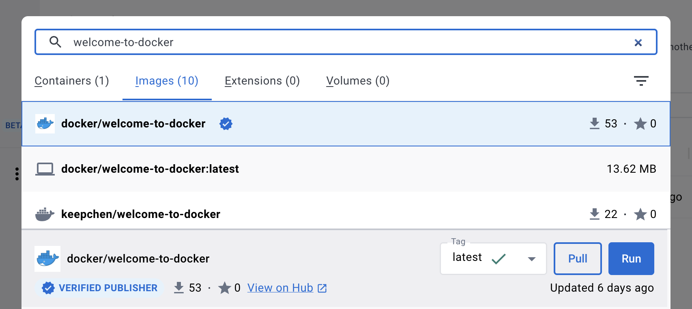
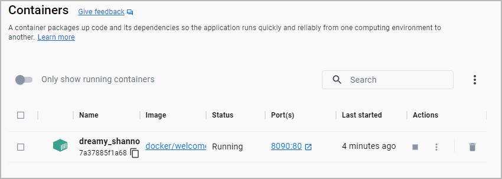

You can share and store images in Docker Hub ([http://hub.docker.com](http://hub.docker.com){:target="_blank" rel="noopener" class="_"}). Docker hub has over 100,000 images created by developers that you can run locally. You can search for Docker Hub images and run them directly from Docker Desktop.

## Step 1: Search for the image

You can search for Docker Hub images on Docker Desktop. Use the search bar, or use the shortcut ⌘K on Mac or Ctrl + K on Windows. In the search, specify `welcome-to-docker` to find the `docker/welcome-to-docker` image you'll use in this guide.

{:width="500px"}

## Step 2: Run the image

To run the `docker/welcome-to-docker` image, select **Run**. When the **Optional settings** appear, specify the **Host port** number `8090` and then select **Run**.

{:width="500px"}

> **Note**
>
> Many images hosted on Docker Hub have a description that highlights what settings must be set in order to run them. You can read the description for the image on Docker Hub by selecting **View on Hub** or by searching for the image directly on [https://hub.docker.com](https://hub.docker.com){:target="_blank" rel="noopener" class="_"}.

## Step 3: Explore the container

That's it! The container is ready to use. Go to the **Containers** tab in Docker Desktop to view the container.

{:width="500px"}

## What's next

In this guide, your ran someone else's image from Docker Hub. Next, you'll learn how you can publish your own image to Docker Hub.

    <!--start row-->
    

     

        

            

                
            

                <h3 id="publish-your-own-image"><a href="/get-started/publish-your-own-image/">Publish your own image</a></h3>
            

        

    

